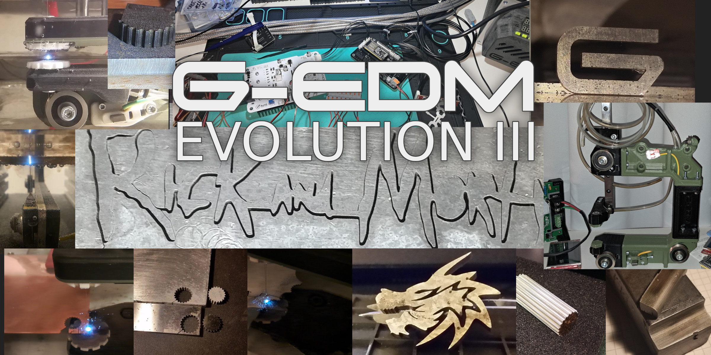
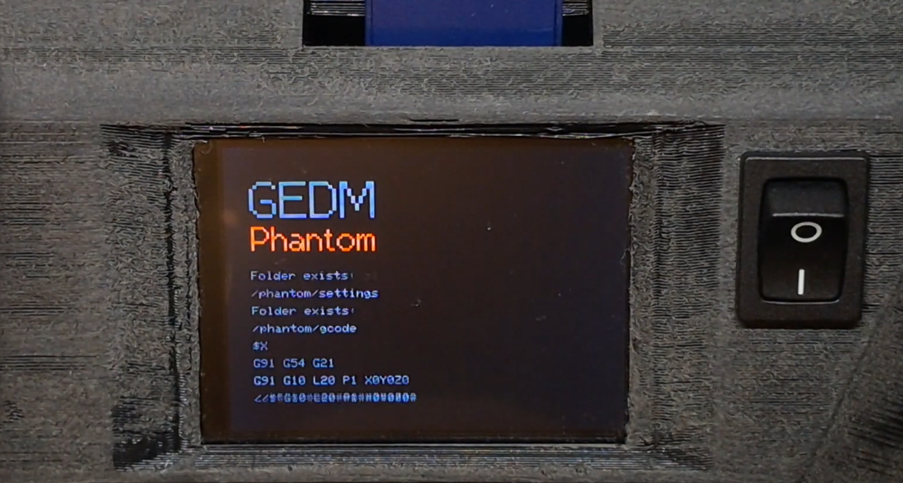
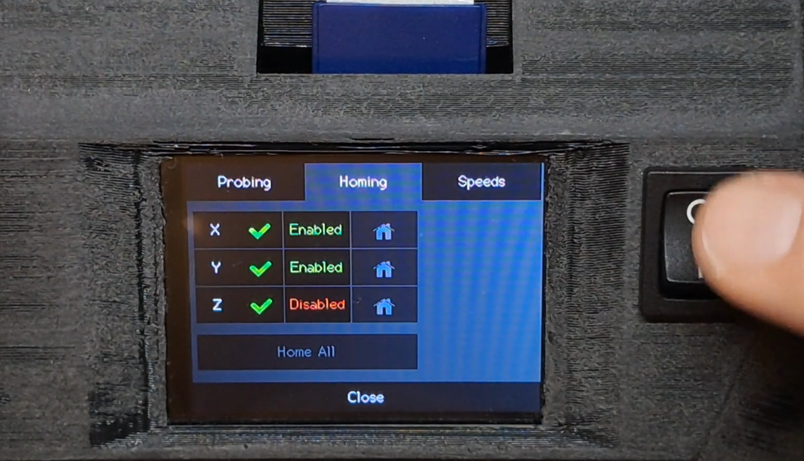
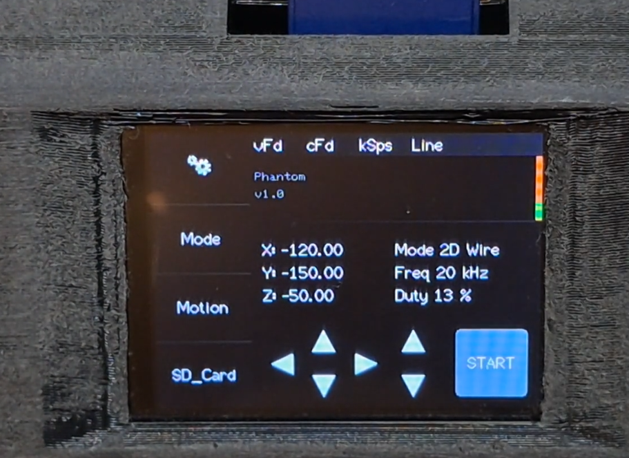
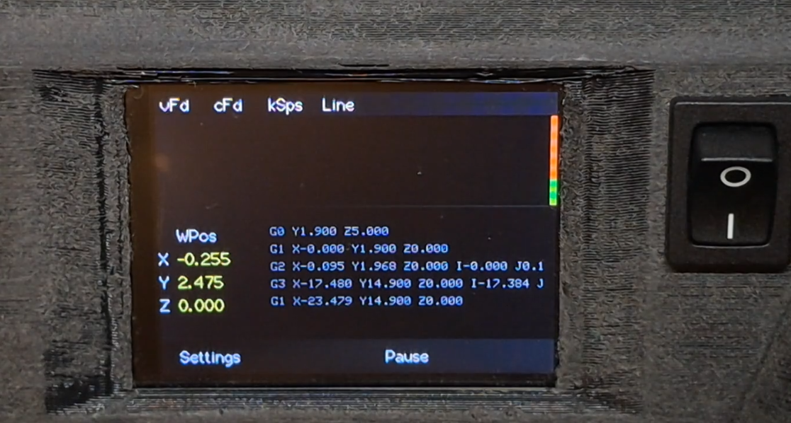
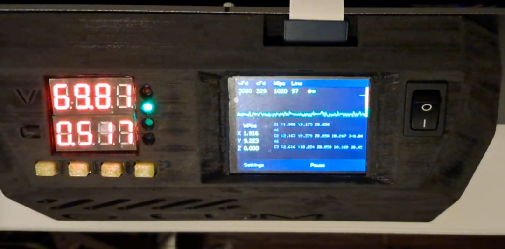
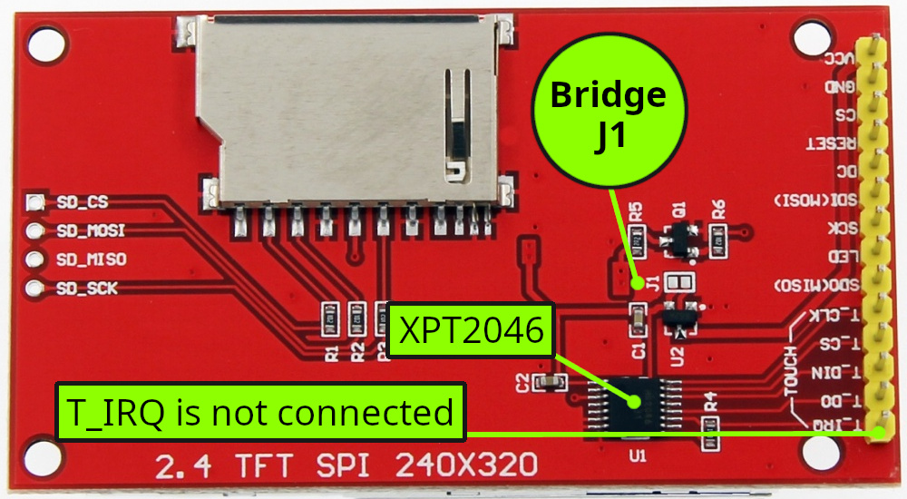
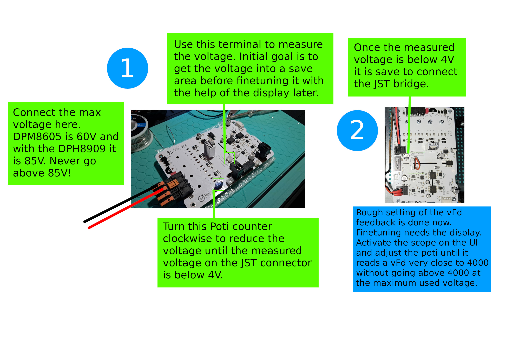
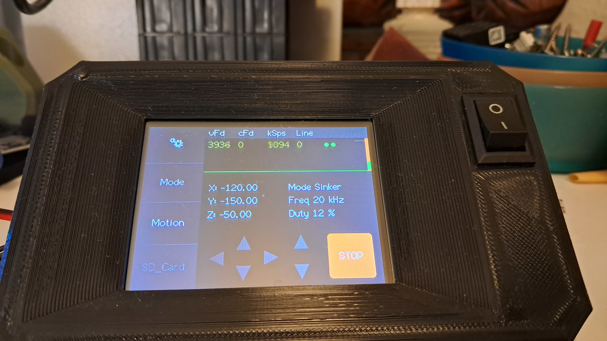

@J.B.
Your package arrived! Made me smile. If you see this please reach out to the new email shown below.
</br>

</br></br>

# Emergency help line - A pizza per call
gedm-support@proton.me


</br>
</br>



</br>
</br>

* Updates
  - Steps per mm setting for the wire feeder stepper
  - Buttons to move the wire back and forward manually
  - Wire feeder stepper is now controlled via mm/min instead of RPM
  
</br>
</br>


* Bugs fixed
  - changing steps per mm via ui was bricked - fixed (5.3.2025)
</br>
</br>

# Reamer mode is not tested yet. Wire and sinker works.
```diff
+ 1. Validate homing routines, XYZ and all with Z enabled and disabled (z not tested but it should work)
+ 2. Validate probing routines (right front edge confirmed working. Other egdes not tested. Should work)
+ 3. Validate sinker mode with and without retractions (Y positive, Y negative, X negative tested with and without flushing interval)
- 4. Validate reamer mode
+ 5. Validate 2d wire mode ( did some cuts. Seems to work)
```
</br>
</br>
</br>

</br>
</br>

</br>

</br>

</br>

</br>

</br>

# G-RBL

    Firmware for wire and sinker EDM machines build with the G-EDM EVO electronics.

    It supports router type CNC machines with three axis plus a spindle stepper. Rotary axis support is planned for the future.

    For 2D wire EDM a z axis is not needed. 

</br>
</br>
# ILI9341 Note
    Jumper J1 needs to be bridged with a little solder. If J1 is not bridged the display is set for 5v operation. The ESP32 operates at 3.3v levels.
    It can fail to write to SD card if J1 is not bridged. Never connect the display to 5v arduino stuff after J1 is bridged.
</br>
</br>

</br>
</br>


# Install

    Download the repo and extract the folder. Load the folder into visual studio code.
    Make sure the platform.io extension is installed in vstudio. After the folder is loaded it will prepare everything.
    This can take some time. Once finished restart vcode. If you already have a running G-EDM firmware on the ESP you can
    update it by placing the compiled binary on the SD card and just insert it. The initial version will require a restart of the ESP
    to start the update. Once the Phantom release is installed a restart is not required anymore for update over SD. 

    To use update via SD card press the compile button. The firmware.bin file should be located in the project folder at /.pio/build/esp32dev/firmware.bin Just copy the firmware.bin file into the top root directory of the SD card.

    If this is the initial install on a fresh ESP without any G-EDM firmware it needs to be flashed from vcode. Just press the upload button while the board is connected via USB. On windows it may be needed to install the USB to UART drivers first: https://www.silabs.com/developer-tools/usb-to-uart-bridge-vcp-drivers

</br>
</br>

# Notes about the correct hardware
Some people expierenced problems with inverted colors on the display and it seems that this is related to cheap ESP32 boards or cheap ILI displays. Mostly it is a bad ESP32 board. So don't cheap out on that and go for the AZdelivery stuff.

Also the router used needs a very high step resolution. 3200 steps per mm seems to work. My router version has around 4000 steps per mm. This is important. The spark gap is tiny and a single step should create a smaller travel then the spark gap. We are talking microns here.


# Factory reset everything after initial install and on updates

After the machine receives an update it is good to factory reset everything. 
Insert an SD card and open the SD menu. Press the last tab and touch the factory reset button. 
This deletes the NVS key value store used to store the settings from the last session.

A factory reset after the initial installation is required. After flashing the firmware on a fresh ESP32
perform a factory reset to write the default params to the NVS storage. If the XYZ positions show as -1 this is due an 
empty NVS storage.


</br>
</br>

# Adjust vFd to match the new stock configuration

The new code has a different configuration for the voltage feedback (vFd) short circuit threshold. 
The new default vFd should be almost 4000 @ the max possible voltage. Set the DPM/DPH to the max voltage. if the DPH is used with the 0-80V PSU something around 80V is the max possible. With the DPM it is 60V. Then turn the motionswitch to OFF and press the start button on the display. This will enable the scope. Ensure that the DPM/DPH is also turned on and adjust the Poti on the pulseboard until the reading below "vFd" shows almost 4000. It should never go above 4000.
</br>
It is very important to have the vFd set to a low voltage feedback before ever connecting the JST bridge to the sensorcircuit!
</br>
</br>
Once the vFd feedback is set it should look like this on the scope with the maximum input voltage turned on. 
To activate the scope turn the motionswitch to OFF, enable the DPM/DPH with the max voltage (max 85v), press the start button on the display.
Now the scope is active and PWM enabled too but with the motionswitch OFF it will not start any process.
Almost 4000 but no spikes above 4000 at the vFd reading.
If the value is >4000 or worse stuck at 4095 turn everything off, buy two pizzas and contact the emergency hotline.
</br></br>

</br></br>

</br></br>


# Hidden features

1: If the screen is touched on bootup it will enforce a display recalibration. Once the display turns black it can be untouched and the calibration will start
</br>
</br>
2: If for some reason the display blanks out in the process it is possible to re-init the display by touching any point on the display that is not a touch element. In the process only two elements are touchable. Settings button and pause button. Touching the area above those buttons will re-init the display (don't know if it works in the case of a bricked screen) Works only if the settingsmenu is not open.

</br>
</br>


# What machine should you use?

    This is up to you as long as the machine is a router (no moving table) Support for moving tables will follow but the code started to get complex and therefore I focused on routers and skipped support for mills.

    The Motionboard runs with 4 TMC2209 drivers and I use big Nema17 steppers with 1.67A. A few people removed the TMC drivers and used the raw step/dir signals to run external drivers with Nema23 motors. It is possible too.

I highly recommend to take a look at the work from Alex Treseder for an easy to build wire EDM machine:</br>

https://github.com/alextreseder/picoEDM


</br>
</br>
</br>
# Follow the project:

[>>> Stay informed on Hackaday <<<](https://hackaday.io/project/190371-g-edm)


</br>
</br>

# Donations

    * You want to donate something to support the project? 
    * Paypal: paypal.me/gedmdev
    * Bitcoin: bc1qkz8vwrd3pupewdtyg09qj9nv249vlgdy4ffhyv

</br>
</br>
</br>

# Legal notes
    The author of this project is in no way responsible for whatever people do with it.
    No warranty. 
</br>
</br>

# Responsible for the content provided

    Lautensack Roland (Germany)

</br>

# License

    All files provided are for private use only if not declared otherwise and any form of commercial use is prohibited.
    
